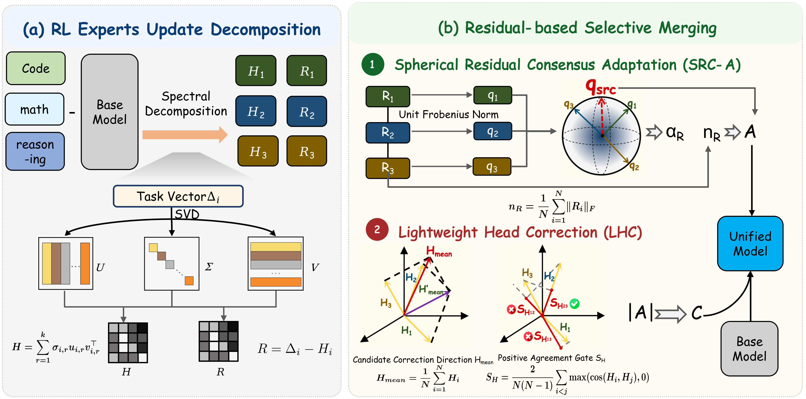
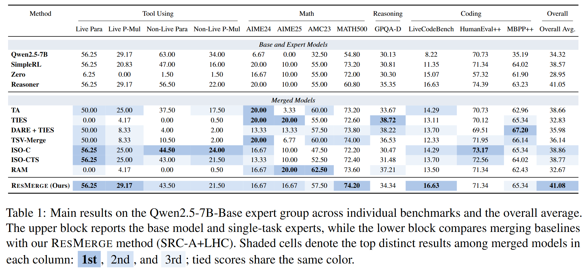
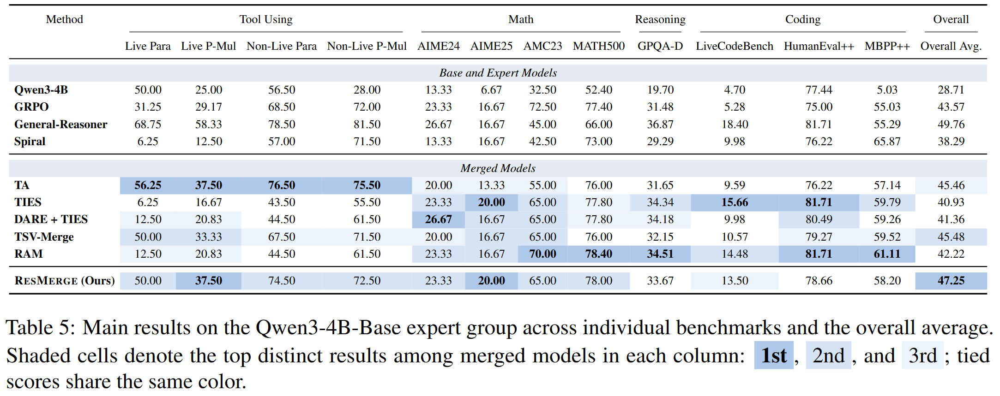

# ResMerge

ResMerge is a data-free merging method designed for reinforcement learning
post-trained language model experts that share the same base model. It targets
the spectral structure of reinforcement learning post-training task vectors by
decomposing each update into a rank-`K` spectral head and a residual tail,
building a stable residual backbone with SRC-A, and injecting the spectral head
only as a reliability-gated lightweight correction.

This repository provides the main merging script:

```text
resmerge-main.py
```

The script loads tensors from Hugging Face `safetensors` checkpoints on demand, avoiding the need to load all source checkpoints into memory simultaneously. It supports single-GPU execution and tensor-wise multi-GPU parallel merging, where each complete parameter tensor is assigned to and processed on a single GPU, and saves the merged model as a standard Hugging Face-compatible checkpoint.

## Method Overview

<p align="center">
  
</p>

Given a base model parameter matrix `W0` and `N` expert parameters `Wi`, ResMerge
first forms task vectors:

```text
Delta_i = W_i - W_0
```

For each eligible 2D weight matrix, ResMerge applies SVD and splits the task
vector into two components:

```text
Delta_i = H_i + R_i
```

- `H_i`: rank-`K` spectral head from the leading singular directions.
- `R_i`: residual tail after removing the spectral head.

The residual tails are merged by SRC-A. Let `q_src` denote the spherical
consensus direction estimated from normalized residual tails, `n_R` the average
residual norm, and `alpha_R` the confidence-dependent residual retention. SRC-A
constructs the residual backbone as:

```text
A = alpha_R * n_R * q_src
```

The spectral heads are averaged into a candidate head direction. ResMerge then
computes cross-expert head agreement `S_H` and injects only a lightweight
correction:

```text
C = rho * S_H * ||A||_F * normalize(H_mean)
```

The final merged task vector is:

```text
M = A + C
W_merge = W_0 + M
```

For non-eligible tensors such as embeddings, `lm_head`, normalization tensors,
and 1D parameters, the default behavior is task arithmetic.

## Model Requirements

- `--base_model` and every entry in `--task_models` must be local
  Hugging Face causal language model directories.
- Checkpoints must use `safetensors`, either as a single
  `model.safetensors` file or as a sharded checkpoint with a
  `model.safetensors.index.json` file.
- The expert models must share the same architecture and base
  initialization, with compatible parameter names, parameter shapes,
  tokenizer, and vocabulary.
- Adapter-only and quantized checkpoints are not currently supported.
  LoRA adapters should first be merged into the base model and saved as
  full `safetensors` checkpoints.

## Environment Setup

Recommended environment:

```bash
conda create -n resmerge python=3.10
conda activate resmerge
```

Install PyTorch matching your CUDA version, then install the minimal
dependencies:

```bash
pip install -r requirements.txt
```

## Quick Start

Example command:

```bash
python resmerge-main.py \
  --base_model /path/to/base_model \
  --task_models /path/to/expert_1 /path/to/expert_2 /path/to/expert_3 \
  --output_dir /path/to/resmerge_output \
  --device cuda \
  --gpu_ids 0,1,2,3 \
  --rank_topk 1 \
  --head_ratio_budget 0.2 \
  --save_dtype bf16
```

Depending on model size and the files available in the base checkpoint, the output directory typically contains:

```text
config.json
generation_config.json
model-*.safetensors
model.safetensors.index.json
tokenizer files
```

You can load it with:

```python
import torch
from transformers import AutoModelForCausalLM, AutoTokenizer

model_path = "/path/to/resmerge_output"
tokenizer = AutoTokenizer.from_pretrained(model_path, trust_remote_code=True)
model = AutoModelForCausalLM.from_pretrained(
    model_path,
    torch_dtype=torch.bfloat16,
    device_map="auto",
    trust_remote_code=True,
)
```

## Arguments Used in Quick Start

```text
--base_model
    Path to the shared base model.

--task_models
    Paths to compatible expert models derived from the same base model.

--output_dir
    Directory for the merged Hugging Face checkpoint.

--device
    Use cuda or cpu. CUDA is recommended.

--gpu_ids
    Comma-separated GPU IDs used for tensor-wise multi-GPU parallel merging.

--rank_topk
    Number of leading singular components treated as the spectral head.
    The default paper setting is 1.

--head_ratio_budget
    The residual-relative head budget rho. It controls the maximum norm of the
    lightweight head correction relative to the SRC-A residual backbone.

--save_dtype
    Output checkpoint dtype. The default paper setting is bf16.
```

## Main Results

### Qwen2.5-7B-Base

<p align="center">
  
</p>

### Qwen3-4B-Base

<p align="center">
  
</p>
## Evaluation

The merged checkpoint can be evaluated as a standard Hugging Face causal
language model. We use the following open-source evaluation frameworks:

- **Tool using:** We use
  [BFCL V3](https://gorilla.cs.berkeley.edu/blogs/13_bfcl_v3_multi_turn.html)
  with the
  [official BFCL evaluation code](https://github.com/ShishirPatil/gorilla/tree/main/berkeley-function-call-leaderboard).
- **Memory:** We use [MemAgent](https://github.com/BytedTsinghua-SIA/MemAgent) to evaluate long-context retention and retrieval capabilities.
- **Mathematics, coding, and general reasoning:** We use
  [Evalchemy](https://github.com/mlfoundations/evalchemy) as the unified
  evaluation framework.

The benchmarks used in our experiments and links to their corresponding
papers or official sources are listed below. Please keep the same prompt
templates, decoding settings, dataset versions, and sample counts when
comparing the base model, expert models, baseline merging methods, and
ResMerge.

### Benchmark References

- **Mathematics**
  - **AIME 2024:** [Dataset source](https://huggingface.co/datasets/di-zhang-fdu/AIME_1983_2024) | [Official MAA AIME page](https://maa.org/maa-invitational-competitions/)
  - **AIME 2025:** [Dataset source](https://huggingface.co/datasets/TIGER-Lab/AIME25) | [Official MAA AIME page](https://maa.org/maa-invitational-competitions/)
  - **AMC 2023:** [Dataset source](https://huggingface.co/datasets/AI-MO/aimo-validation-amc) | [Official MAA AMC page](https://maa.org/student-programs/amc/)
  - **MATH-500:** [Paper](https://arxiv.org/abs/2305.20050) | [Dataset](https://huggingface.co/datasets/HuggingFaceH4/MATH-500)

- **Coding**
  - **LiveCodeBench (`release_v2`):** [Paper](https://arxiv.org/abs/2403.07974) | [Official repository](https://github.com/LiveCodeBench/LiveCodeBench)
  - **HumanEvalPlus:** [EvalPlus paper](https://arxiv.org/abs/2305.01210) | [Dataset](https://huggingface.co/datasets/evalplus/humanevalplus) | [Official repository](https://github.com/evalplus/evalplus)
  - **MBPPPlus:** [EvalPlus paper](https://arxiv.org/abs/2305.01210) | [Dataset](https://huggingface.co/datasets/evalplus/mbppplus) | [Official repository](https://github.com/evalplus/evalplus)

- **General Reasoning**
  - **GPQA-Diamond:** [Paper](https://arxiv.org/abs/2311.12022) | [Official dataset](https://huggingface.co/datasets/Idavidrein/gpqa)

- **Tool Use**
  - **BFCL V3:** [Official BFCL V3 page](https://gorilla.cs.berkeley.edu/blogs/13_bfcl_v3_multi_turn.html) | [Official evaluation code](https://github.com/ShishirPatil/gorilla/tree/main/berkeley-function-call-leaderboard)
- **Memory**
  - **HotpotQA:** (`7K` and `14K` context settings)[Paper](https://aclanthology.org/D18-1259/) | [Official website](https://hotpotqa.github.io/)
  - **SQuAD:** (`32K` context setting)[Paper](https://aclanthology.org/D16-1264/) | [Official website](https://rajpurkar.github.io/SQuAD-explorer/)